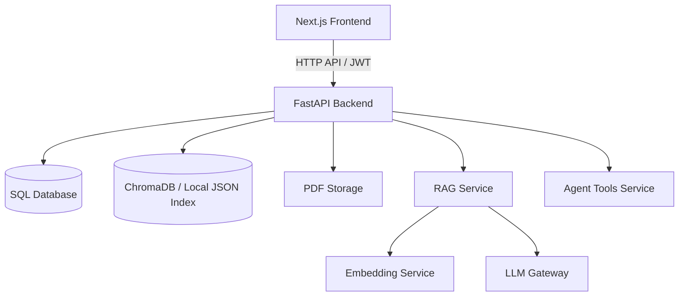
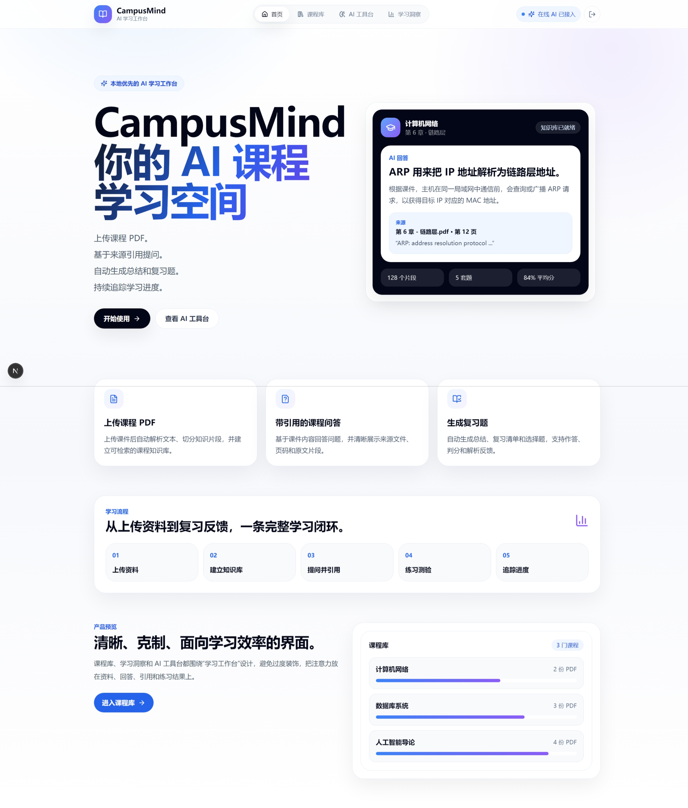
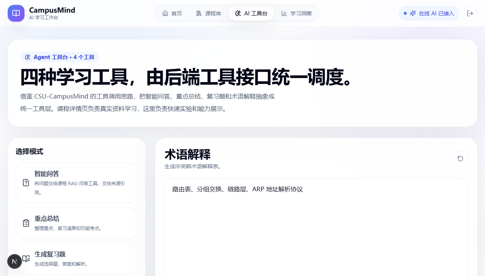
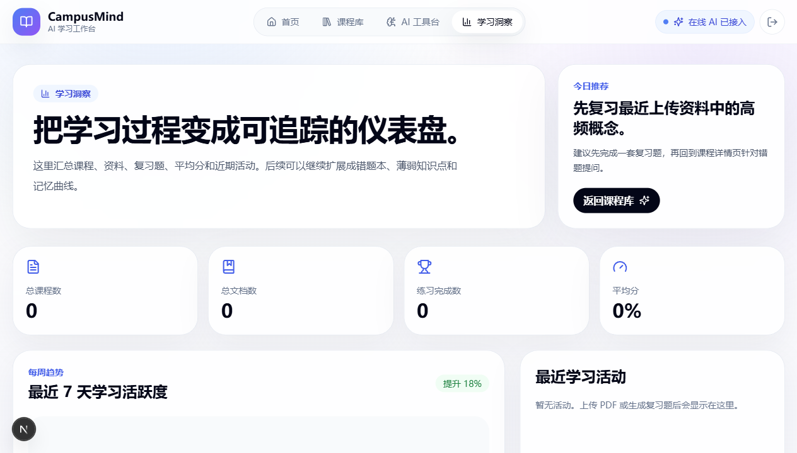

# CampusMind AI Study Assistant

面向大学课程学习场景的 AI 学习工作台。

CampusMind 将课程 PDF、讲义和教材转化为可检索、可问答、可总结、可练习、可追踪的学习闭环。

---

## 目录

- [项目简介](#项目简介)
- [核心功能](#核心功能)
- [技术栈](#技术栈)
- [系统架构](#系统架构)
- [快速启动（推荐）](#快速启动推荐)
- [手动启动](#手动启动)
- [一键启动脚本说明](#一键启动脚本说明)
- [截图总览（完整）](#截图总览完整)
- [截图拍摄规范](#截图拍摄规范)
- [常见问题](#常见问题)
- [项目结构](#项目结构)
- [后续规划](#后续规划)

---

## 项目简介

在真实学习场景中，学生常见痛点是：资料分散、检索低效、AI 回答不贴课件、复习缺少闭环。

CampusMind 的目标是把学习流程串成一条线：

```text
上传课程 PDF -> 自动解析与索引 -> 基于课件问答 -> 自动总结 -> 生成 Quiz -> 作答判分 -> 学习统计
```

---

## 核心功能

- 用户系统：注册、登录、JWT 鉴权
- 课程管理：创建课程、课程详情、课程资源隔离
- 文档处理：单文件/批量 PDF 上传与解析
- RAG 问答：基于课程资料回答问题并返回来源引用
- Agent 工具台：Ask AI / Summary / Quiz / Glossary
- 练习闭环：题目生成、作答、判分、解析
- 学习洞察：课程数、文档数、练习数、得分等统计
- 多语言支持：中/英/韩术语解释与对照

---

## 技术栈

- 前端：Next.js 16、React 19、TypeScript、Tailwind CSS
- 后端：FastAPI、SQLAlchemy、Pydantic、Uvicorn
- 检索：ChromaDB（支持本地 JSON 回退）
- PDF：PyMuPDF
- 模型接入：OpenAI-compatible API / 可选 Ollama
- 测试：pytest、Next.js build

---

## 系统架构



---

## 快速启动（推荐）

### Windows 一键启动

双击项目根目录：

```text
CampusMind-Launch.vbs
```

或：

```text
CampusMind-Launch.bat
```

或 PowerShell：

```powershell
.\CampusMind-Start.ps1
```

启动后访问：

- 前端：[http://localhost:3000](http://localhost:3000)
- 后端健康检查：[http://127.0.0.1:8000/health](http://127.0.0.1:8000/health)
- API 文档：[http://127.0.0.1:8000/docs](http://127.0.0.1:8000/docs)

---

## 手动启动

### 1) 后端

```powershell
cd backend
python -m venv .venv312
.\.venv312\Scripts\python.exe -m pip install -r requirements.txt
.\.venv312\Scripts\python.exe -m uvicorn main:app --host 127.0.0.1 --port 8000
```

### 2) 前端

```powershell
cd frontend
npm install
npm.cmd run dev:host
```

> 说明：在 PowerShell 中若 `npm` 被执行策略拦截，请使用 `npm.cmd`。

---

## 一键启动脚本说明

仓库包含以下启动脚本：

- `CampusMind-Launch.vbs`：双击无脚本策略干扰，适合日常使用
- `CampusMind-Launch.bat`：命令行可见，便于排错
- `CampusMind-Start.ps1`：主启动逻辑
- `start-local.ps1 / start-local.bat`：早期兼容脚本

---

## 截图总览（完整）

> 图片目录：`deliverables/assets/`

### A. 用户与入口

1. 登录页  


2. 注册页  


### B. 课程与资料

3. 首页（产品主视觉）  


4. 课程库（多课程卡片）  


5. 新建课程弹窗  


6. 课程详情页（文档列表）  


7. PDF 上传进行中  


8. PDF 处理完成（页数/chunk）  


### C. AI 学习能力

9. AI 问答（含来源引用）  


10. Summary 结果  


11. Quiz 生成配置  


12. Quiz 作答结果（分数+解析）  


13. 术语解释（中英韩对照）  


### D. 学习追踪

14. 学习洞察页（统计+趋势）  


### E. 工程可用性

15. 后端健康检查 `/health`  


16. FastAPI 文档 `/docs`  


17. 一键启动成功（前后端均 ready）  


---

## 截图拍摄规范

为保证 README 观感统一，建议：

- 分辨率优先：`1920x1080`（或同比例）
- 浏览器缩放：`100%`
- 深色/浅色主题保持一致
- 每张图尽量保留完整关键区域（不要只截局部）
- 关键操作图可加序号：`01-login.png` 风格也可以
- 避免包含本机隐私信息（邮箱、路径、token）

---

## 常见问题

### 1) `git push` 提示 `fetch first`

先执行：

```powershell
git pull --rebase origin main
git push origin main
```

### 2) 后端 8000 端口被占用

报错类似 `[WinError 10048]`，改用其他端口即可，例如 `8010`。

### 3) PowerShell 无法执行 `npm`

使用：

```powershell
npm.cmd run dev:host
```

### 4) 控制台出现中文乱码

优先使用 `CampusMind-Launch.vbs` 启动，通常可规避终端编码冲突。

---

## 项目结构

```text
campusmind-ai-study-assistant/
  backend/
    app/
      api/
      core/
      db/
      schemas/
      services/
      tests/
  frontend/
    src/
      app/
        dashboard/
        courses/
        lab/
        insights/
        login/
        register/
      components/
      lib/
  deliverables/
    assets/
  docs/
  CampusMind-Launch.bat
  CampusMind-Launch.vbs
  CampusMind-Start.ps1
  start-local.bat
  start-local.ps1
  README.md
```

---

## 后续规划

- 支持 OCR（扫描版 PDF）
- 支持 PPTX / DOCX 解析
- 增加错题本与薄弱点分析
- 增加记忆卡片与间隔复习
- 引入后台任务队列
- 完善 CI/CD 与云部署

---

## License

MIT
