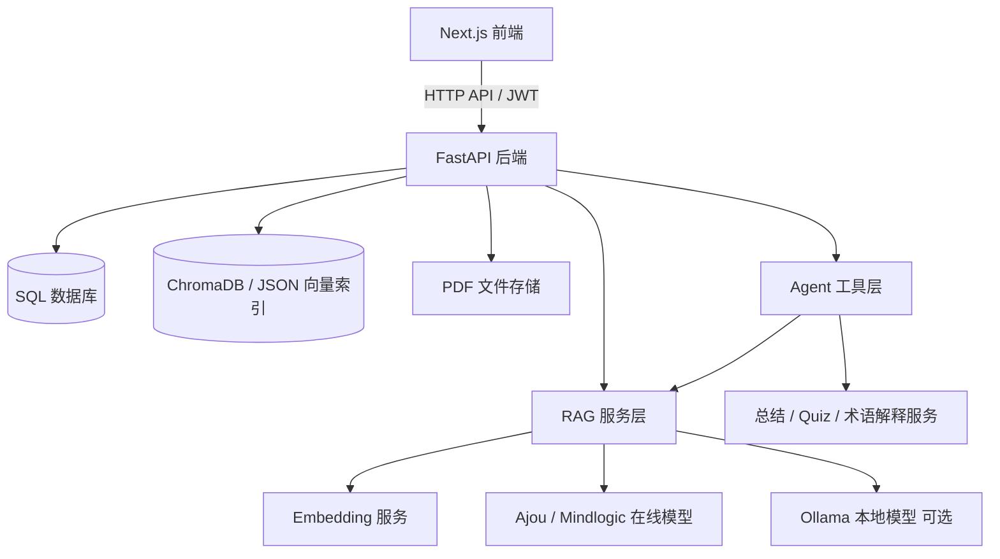
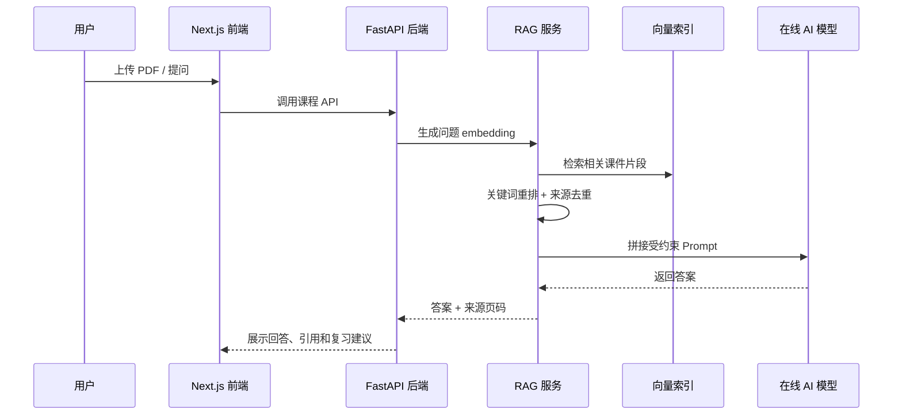

# CampusMind

CampusMind 是一个面向大学生的 AI 课程学习工作台。它可以把课程 PDF、讲义和教材转成可检索、可问答、可总结、可练习的个人课程知识库，帮助学生围绕真实课件完成学习闭环。

项目借鉴了 CSU-CampusMind 中“RAG + Agent 工具调用”的工程思路，但定位更聚焦：不是校园综合助手，而是课程资料驱动的学习助手。

## 项目介绍

大学生学习时常遇到几个问题：

- 课件、教材和讲义很多，搜索困难。
- 普通 AI 不知道自己的课程内容，回答容易泛泛而谈。
- 复习缺少闭环，难以从“看资料”自然进入“总结、练习、纠错”。

CampusMind 的目标是把学生自己的课程资料转化成 AI 学习工作台：

```text
上传课程 PDF -> 解析文本 -> 切分知识片段 -> 建立向量索引
-> 基于课件问答 -> 自动总结 -> 生成 Quiz -> 作答判分 -> 学习统计
```

## 功能列表

- 用户注册、登录和 JWT 鉴权
- 课程创建、课程库和课程详情管理
- 单个 PDF 上传和多 PDF 批量上传
- 自动解析 PDF 文本、切分 chunk、建立课程知识库
- 基于课程资料的 RAG 问答
- 回答中展示来源文件、页码和原文片段
- 自动生成课件总结和复习清单
- 生成结构化选择题 Quiz
- 前端作答、后端自动判分、返回解析反馈
- 中 / 英 / 韩术语解释与对照
- Agent 工具台：Ask AI、Summary、Quiz、Glossary 四种模式
- 学习统计：课程数、文档数、题库数、练习次数、平均得分、近期活动
- 多页面交互：首页、课程库、课程详情、AI 工具台、学习洞察、登录、注册
- 支持本机开发、局域网演示和 Docker 部署

## 技术栈

| 模块 | 技术 |
|---|---|
| 前端 | Next.js 16、React 19、TypeScript、Tailwind CSS、lucide-react |
| 后端 | FastAPI、SQLAlchemy、Pydantic、Uvicorn |
| AI | Ajou / Mindlogic API Gateway，OpenAI-compatible Chat Completions |
| RAG | PDF 文本解析、chunk 切分、embedding、语义检索、关键词重排、Prompt 组装 |
| Agent 工具层 | FastAPI 工具路由，将问答、总结、出题、术语解释统一封装 |
| 向量索引 | ChromaDB Server，支持回退到本地 JSON 向量索引 |
| 数据库 | SQLite，支持通过 `DATABASE_URL` 切换 PostgreSQL / MySQL |
| PDF 解析 | PyMuPDF |
| 测试 | pytest、Next.js build |
| 部署 | Docker、Docker Compose、本地一键启动脚本 |

## 系统架构



### RAG 问答流程



### Agent 工具台

参考 CSU-CampusMind 的 Agent 工具思想，CampusMind 新增了轻量工具层：

| 工具 | 作用 |
|---|---|
| Ask AI | 基于课程资料回答问题 |
| Summary | 生成重点总结和复习清单 |
| Quiz | 根据知识点生成选择题 |
| Glossary | 输出中 / 英 / 韩术语解释 |

接口：

```text
GET  /api/agent/tools
POST /api/agent/run
```

这样前端不再把功能散落在多个页面中，而是可以通过统一工具台调用后端能力。

## 项目截图

### 首页


### 课程库


### 学习洞察


## 运行方式

### 方式一：Windows 本地一键启动

双击项目根目录中的：

```text
start-local.bat
```

或者在 PowerShell 中运行：

```powershell
.\start-local.ps1
```

脚本会自动完成：

- 检查并创建 `.env`
- 创建后端虚拟环境
- 安装后端依赖
- 安装前端依赖
- 启动 FastAPI 后端
- 启动 Next.js 前端
- 自动打开浏览器

启动后访问：

```text
http://localhost:3000
```

API 文档：

```text
http://127.0.0.1:8000/docs
```

### 方式二：手动启动

复制环境变量：

```bash
cp .env.example .env
```

推荐配置：

```env
AI_PROVIDER=openai
EMBEDDING_PROVIDER=mock
OPENAI_BASE_URL=https://factchat-cloud.mindlogic.ai/v1/gateway
OPENAI_API_KEY=your_key_here
OPENAI_CHAT_MODEL=gpt-5-mini
NEXT_PUBLIC_API_BASE_URL=auto
```

启动后端：

```powershell
cd backend
python -m venv .venv
.\.venv\Scripts\activate
pip install -r requirements.txt
uvicorn main:app --reload --host 0.0.0.0 --port 8000
```

启动前端：

```powershell
cd frontend
npm install
npm run dev:host
```

### 方式三：Docker 启动

```bash
docker compose up --build
```

如果需要同时启动 Ollama：

```bash
docker compose --profile local-ai up --build
```

## 使用流程

1. 注册或登录账号。
2. 进入课程库，创建课程。
3. 进入课程详情页。
4. 上传一份或多份 PDF。
5. 等文档状态变为“已就绪”。
6. 在问答区输入课程问题。
7. 查看 AI 回答、来源文件、页码和原文片段。
8. 生成课程总结或 Quiz。
9. 完成 Quiz 作答，查看得分和解析。
10. 在学习洞察中查看整体学习状态。

## 项目结构

```text
campusmind-ai-study-assistant/
  backend/
    app/
      api/
      core/
      db/
      schemas/
      services/
      tests/
  frontend/
    src/
      app/
        dashboard/
        courses/
        lab/
        insights/
        login/
        register/
      components/
      lib/
  docs/
  deliverables/
  docker-compose.yml
  start-local.bat
  start-local.ps1
```

## 与 CSU-CampusMind 的对比优化

CSU-CampusMind 更像校园综合智能体，包含教务、图书馆、就业、OA、移动端和网页抓取。CampusMind 更适合作为课程学习产品，因此本次优化选择性借鉴了：

- 清晰的 README 导航和工程说明
- RAG + 工具调用的产品表达
- 将 AI 能力抽象成工具层
- 为后续流式输出、后台任务和多知识库扩展预留结构

暂时没有引入教务系统、图书馆、OA 等校园集成，因为它们会偏离“课程资料学习助手”的核心目标。

## 未来计划

- 支持扫描版 PDF OCR
- 支持 PPTX、DOCX、图片课件解析
- 增加错题本和薄弱知识点归纳
- 增加记忆卡片和间隔复习
- 支持流式 AI 回答
- 支持学习总结、Quiz、错题本导出为 PDF / Word
- 引入后台任务队列，处理大文件解析
- 增加教师端和班级课程空间
- 增加知识图谱可视化
- 增加 GitHub Actions CI/CD 和云端部署配置

## 验证命令

后端测试：

```bash
cd backend
python -m pytest
```

前端构建：

```bash
cd frontend
npm run build
```

## GitHub 信息

推荐仓库名：

```text
campusmind-ai-study-assistant
```

推荐描述：

```text
面向大学生的 AI 课程学习助手，支持 PDF 问答、课件总结、复习题生成和学习洞察。
```

推荐 Topics：

```text
ai rag llm fastapi nextjs chromadb study-assistant pdf-chatbot university
```

## License

MIT
