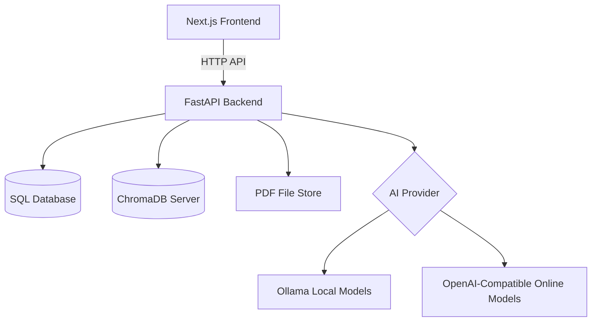
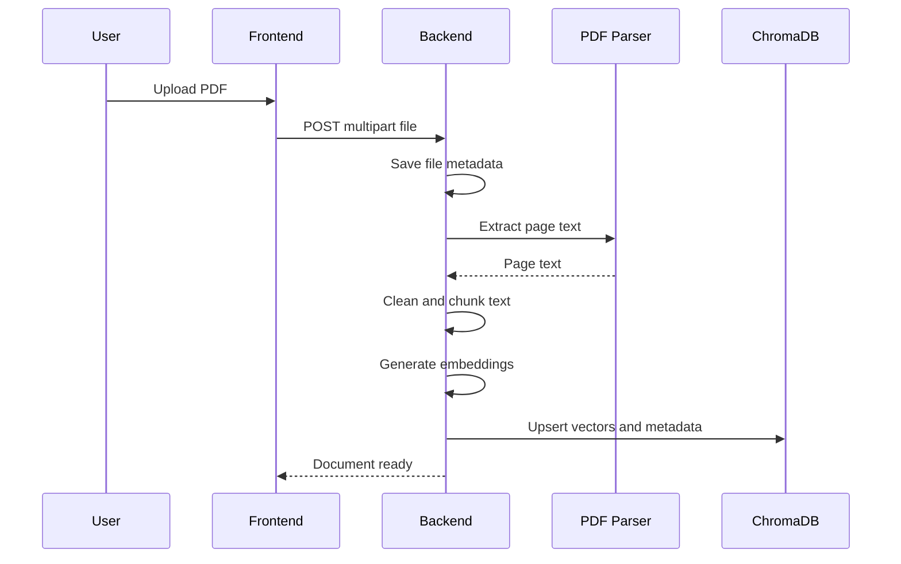

# Architecture

CampusMind is a full-stack RAG application for course-based study workflows.

## Upload Pipeline

## Question Answering Pipeline

1. User asks a course-specific question.
2. Backend embeds the question.
3. ChromaDB retrieves the most relevant chunks.
4. Backend builds a grounded prompt with retrieved context.
5. The configured AI model generates the answer.
6. The answer is saved to chat history with source metadata.

## AI Provider Modes

- `AI_PROVIDER=ollama`: local-first generation through Ollama.
- `AI_PROVIDER=openai`: online generation through an OpenAI-compatible `/chat/completions` endpoint.

Embeddings are generated through Ollama. During development, `ALLOW_MOCK_AI=true` enables deterministic fallback embeddings when Ollama is unavailable.
