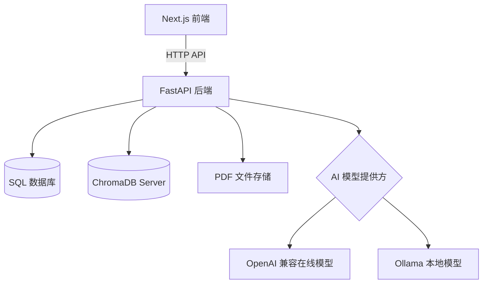
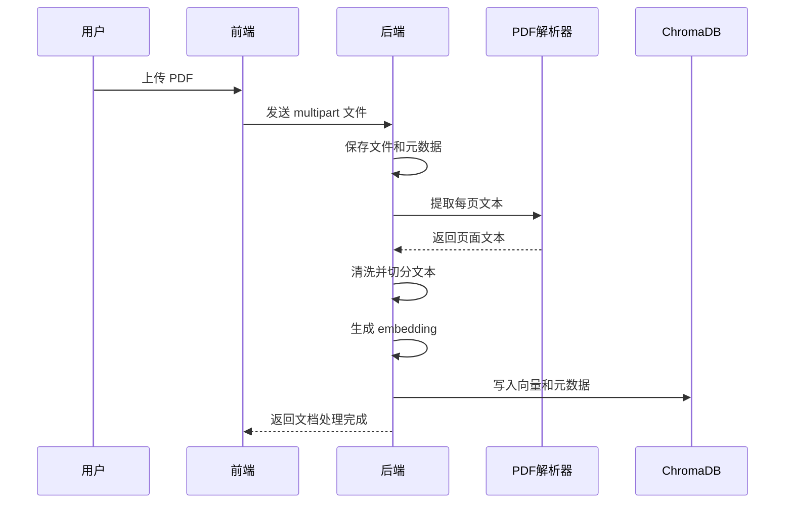

# 系统架构

CampusMind 是一个面向课程资料学习场景的全栈 RAG 应用。

## 上传处理流程

## 问答流程

1. 用户在课程页面提出问题。
2. 后端为问题生成 embedding。
3. ChromaDB 检索最相关的课件片段。
4. 后端把检索结果组装为受约束的 RAG Prompt。
5. 配置的 AI 模型生成回答。
6. 回答和来源信息写入聊天记录。

## AI 模式

- `AI_PROVIDER=openai`：使用 OpenAI 兼容的 `/chat/completions` 在线接口生成回答。
- `AI_PROVIDER=ollama`：使用 Ollama 本地模型生成回答。

Embedding 默认由 OpenAI 兼容的 `/embeddings` 在线接口生成。开发阶段如果没有配置 API Key，并且 `ALLOW_MOCK_AI=true`，系统会使用确定性备用 embedding，保证基础流程可以演示。
