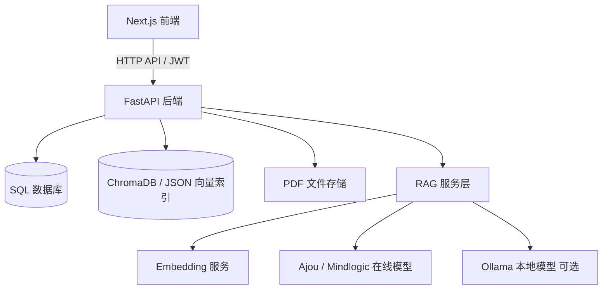
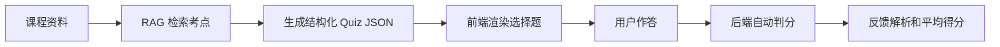
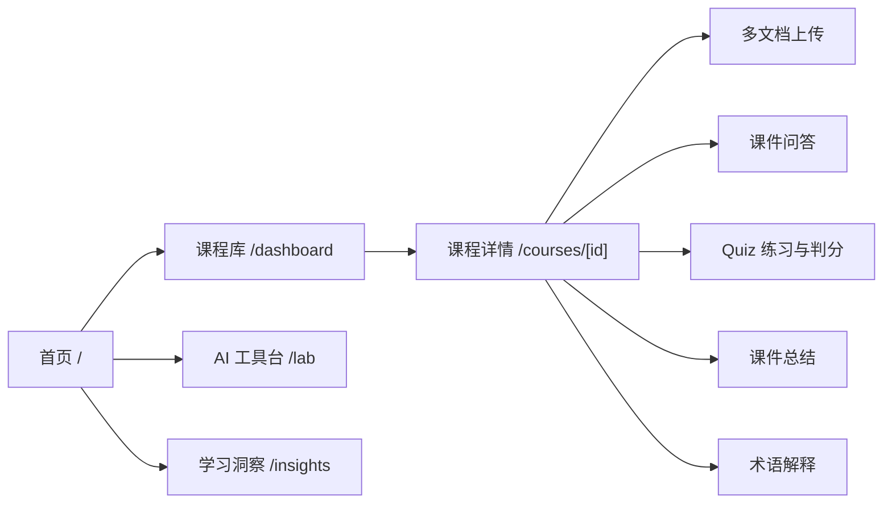

# 系统架构

CampusMind 是一个面向课程资料学习场景的全栈 RAG 应用。系统由 Next.js 前端、FastAPI 后端、SQL 数据库、向量索引和在线 AI 网关组成。

## 上传处理流程

## 问答流程

1. 用户在课程详情页提出问题。
2. 后端为问题生成 embedding。
3. 向量索引召回候选片段。
4. RAG 服务用关键词匹配进行混合重排。
5. 系统对来源做多文档去重，避免单一文件占满上下文。
6. 后端把检索结果组装为受约束的 Prompt。
7. 在线模型生成回答。
8. 回答和来源信息写入聊天记录。

## Quiz 学习闭环

## AI 模式

- `AI_PROVIDER=openai`：使用 OpenAI 兼容的 `/chat/completions` 在线接口生成回答。
- `AI_PROVIDER=ollama`：使用 Ollama 本地模型生成回答。
- `EMBEDDING_PROVIDER=mock`：使用本地哈希 embedding，适合网关没有 embedding 接口的演示场景。
- `EMBEDDING_PROVIDER=openai`：使用在线 embedding 接口。

## 前端页面结构

前端采用 Apple 官网式高级感设计：明亮背景、大标题、充足留白、高对比文字、柔和卡片和轻动画。课程详情页是主要学习工作台，负责把资料上传、RAG 问答、总结、Quiz 和术语解释连接成完整学习闭环。
