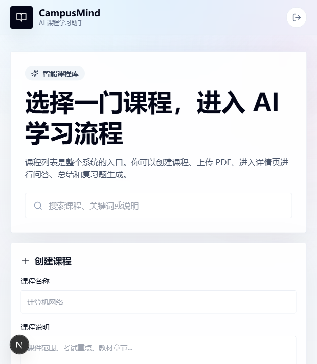
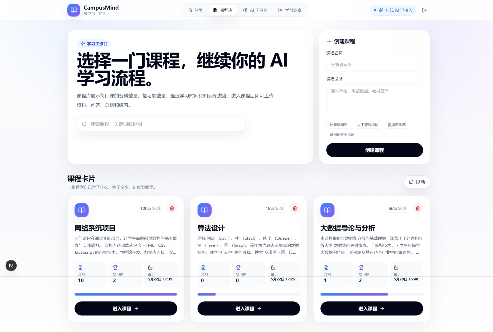
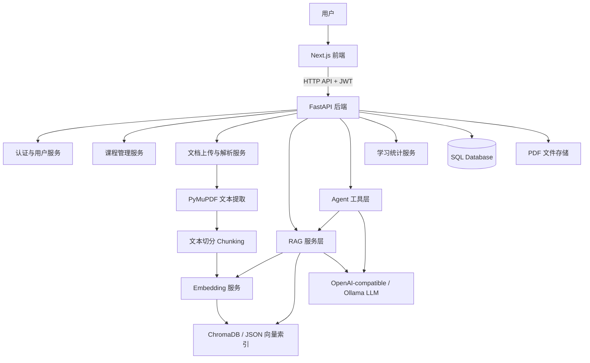
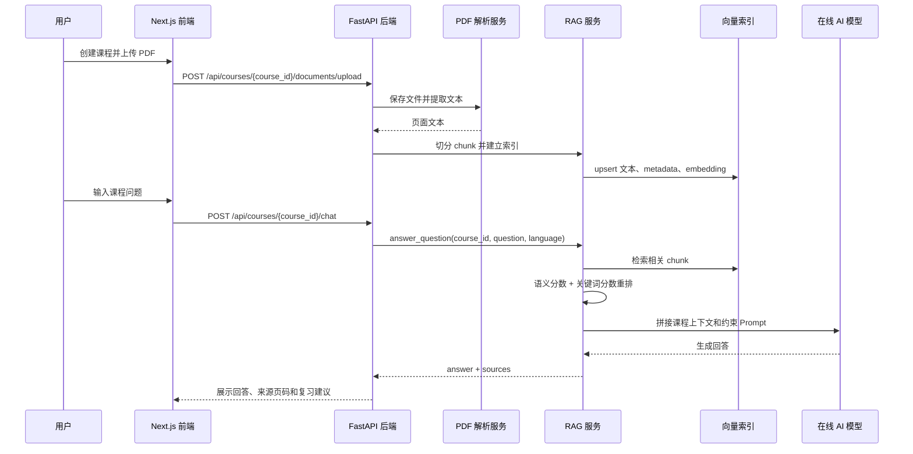
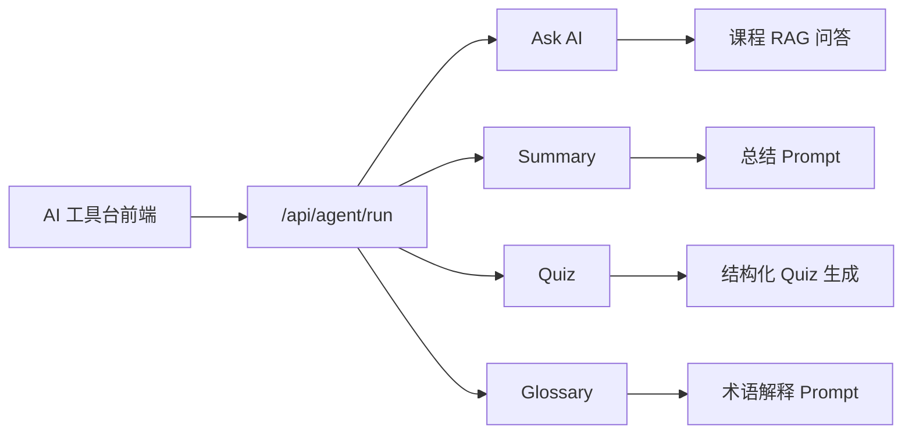
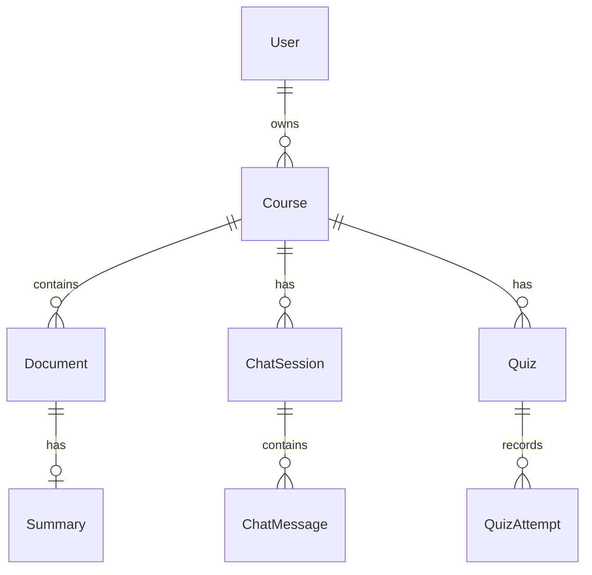
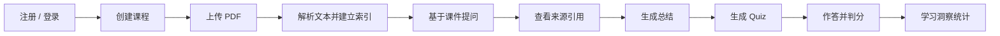

# CampusMind

> 面向大学生课程学习场景的 AI 学习工作台。  
> 将课程 PDF、讲义和教材转化为可检索、可问答、可总结、可练习、可追踪的个人课程知识库。

CampusMind is an AI-powered study workspace for university courses. It combines PDF parsing, RAG retrieval, AI question answering, quiz generation, glossary extraction, and learning analytics into a complete study workflow.

---

## 目录

- [项目简介](#项目简介)
- [项目背景](#项目背景)
- [核心功能](#核心功能)
- [项目截图](#项目截图)
- [技术栈](#技术栈)
- [系统架构](#系统架构)
- [RAG 工作流程](#rag-工作流程)
- [Agent 工具台](#agent-工具台)
- [数据模型](#数据模型)
- [API 设计](#api-设计)
- [项目结构](#项目结构)
- [快速开始](#快速开始)
- [环境变量说明](#环境变量说明)
- [Docker 部署](#docker-部署)
- [测试与验证](#测试与验证)
- [使用流程](#使用流程)
- [项目亮点](#项目亮点)
- [当前限制](#当前限制)
- [未来计划](#未来计划)
- [License](#license)

---

## 项目简介

CampusMind 是一个围绕“大学课程资料学习”设计的 AI 学习助手。它不是普通聊天机器人，而是一个以课程资料为核心的学习工作台。

用户可以创建课程、上传课程 PDF，系统会自动解析 PDF 文本，切分知识片段，建立向量索引。之后，用户可以基于自己的课程资料进行 AI 问答、生成课件总结、生成复习题、进行自动判分，并在学习洞察页面查看整体学习进度。

项目的核心目标是：

- 降低课程资料整理成本
- 让 AI 回答基于真实课件，而不是泛泛而谈
- 将“上传资料、理解内容、总结重点、生成练习、完成反馈”连接成完整闭环
- 为学生提供一个清晰、克制、可持续使用的 AI 学习空间

---

## 项目背景

在大学学习中，学生经常会遇到以下问题：

1. **资料分散**  
   课程 PDF、讲义、教材、课堂截图和作业资料往往散落在不同位置，复习时很难快速定位知识点。

2. **普通 AI 缺少课程上下文**  
   直接向通用 AI 提问时，模型并不知道当前课程的教材内容、老师课件重点和考试范围，回答容易过宽、过泛，甚至出现幻觉。

3. **复习过程缺少闭环**  
   很多学习工具只解决“看资料”或“聊天问答”其中一环，无法自然进入总结、刷题、判分、纠错和统计。

CampusMind 试图解决这些问题。它以课程为单位组织资料，以 RAG 为核心连接课件和 AI，以 Quiz 和学习统计形成后续反馈，让学习过程从“临时查资料”变成“长期可追踪的学习流程”。

---

## 核心功能

### 1. 用户系统

CampusMind 支持基础用户系统：

- 用户注册
- 用户登录
- JWT 鉴权
- 前端保存访问令牌
- 每个用户只能访问自己的课程、资料、问答记录和练习记录

这让系统不仅是一个前端 Demo，而是具备多用户学习空间的基础形态。

---

### 2. 课程管理

用户可以在课程库中创建和管理不同课程，例如：

- 计算机网络
- 数据库系统
- 人工智能导论
- 算法设计
- 韩语专业术语

每门课程都可以拥有自己的：

- PDF 文档
- 知识片段
- 问答会话
- 复习题
- 练习记录
- 学习进度

课程库页面会展示课程卡片，包括文档数量、复习题数量、最近学习时间和估算进度。

---

### 3. PDF 上传与解析

在课程详情页中，用户可以上传一份或多份 PDF。

系统会自动完成：

1. 保存上传文件
2. 使用 PyMuPDF 提取 PDF 文本
3. 按页保留来源信息
4. 按 chunk size 和 overlap 切分文本
5. 为每个知识片段生成 embedding
6. 写入 ChromaDB 向量数据库
7. 当 ChromaDB 不可用时回退到本地 JSON 向量索引

当前支持：

- 单 PDF 上传
- 多 PDF 批量上传
- 每个文档记录页数、chunk 数、处理状态和错误信息
- 仅允许上传 PDF 文件
- 批量上传限制为一次最多 8 个 PDF

---

### 4. 基于课程资料的 RAG 问答

用户可以直接向某门课程提问，例如：

- “ARP 协议的作用是什么？”
- “这章考试重点有哪些？”
- “请根据课件解释链路层和网络层的区别。”
- “数据库事务的隔离级别怎么理解？”

系统不会直接把问题交给大模型，而是先进行检索增强：

1. 将问题转成 embedding
2. 在该课程的向量库中检索相关 chunk
3. 结合语义相似度和关键词匹配进行重排
4. 对不同文档来源进行去重和多样化选择
5. 将检索到的课程片段拼接进 Prompt
6. 调用在线 AI 模型生成回答
7. 返回答案、来源文件、页码和原文片段

这样回答会更贴近用户上传的真实课程资料。

---

### 5. 来源引用

CampusMind 的问答结果会展示来源信息，包括：

- 文档名称
- 页码
- chunk id
- 原文片段

这使得用户可以知道 AI 的回答来自哪份课件、哪一页内容。对于课程复习来说，这一点非常重要，因为它能降低幻觉风险，也方便回到原始资料继续学习。

---

### 6. 课件总结

用户可以对已处理完成的 PDF 生成总结。系统会根据课件文本生成：

- 章节摘要
- 核心概念
- 重要公式或定义
- 可能考试重点
- 复习清单
- 中 / 英 / 韩术语对照表

这适合在考试前快速整理课件内容。

---

### 7. Quiz 复习题系统

CampusMind 可以根据课程资料自动生成结构化选择题。

支持参数：

- 题型：multiple choice
- 题目数量
- 输出语言
- 难度：easy / medium / hard
- 关注范围：例如 ARP、SDN、事务隔离级别等

生成结果会被保存为 Quiz。用户可以在前端直接作答，提交后由后端自动判分，并返回每道题的解析反馈。

Quiz 系统让 CampusMind 不只是“回答问题”，而是进一步帮助学生完成主动回忆和自我检测。

---

### 8. 术语解释与中英韩对照

系统支持术语解释工具，可以从用户输入的概念或课件片段中提取学术术语，并生成：

- 术语
- 韩文
- 英文
- 中文
- 解释
- 例句

该功能特别适合在韩国大学学习专业课程时使用。对于需要在中文、英文、韩文之间切换理解专业概念的学生来说，术语表能明显降低学习门槛。

---

### 9. Agent 工具台

CampusMind 将部分 AI 学习能力抽象成统一工具层，目前包含四种工具：

| 工具 | 功能 | 说明 |
|---|---|---|
| Ask AI | 智能问答 | 将问题交给课程 RAG 问答工具，支持来源引用 |
| Summary | 重点总结 | 将输入内容整理成重点总结、复习清单和可能考点 |
| Quiz | 生成复习题 | 根据课程资料或输入文本生成选择题、答案和解析 |
| Glossary | 术语解释 | 生成中 / 英 / 韩术语解释表 |

工具台的价值在于：前端可以通过统一接口调用不同 AI 能力，而不是把每个 AI 功能散落在不同页面中。

---

### 10. 学习洞察

学习洞察页面会统计用户的学习状态，包括：

- 总课程数
- 总文档数
- 已就绪文档数
- 知识片段数量
- Quiz 数量
- 练习次数
- 平均得分
- 最近学习活动

目前页面中还包含学习趋势和薄弱知识点展示，为后续扩展错题本、记忆曲线、薄弱点分析预留空间。

---

## 项目截图

> 如果图片路径不存在，可以将项目截图保存到 `deliverables/assets/` 目录后再更新下方路径。


### 首页


### 课程库


### 学习洞察


### 课程详情页


### AI 工具台


### 复习题系统


### 带来源引用的问答结果

---

## 技术栈

| 模块 | 技术 |
|---|---|
| 前端框架 | Next.js 16、React 19、TypeScript |
| 前端样式 | Tailwind CSS |
| 图标 | lucide-react |
| 后端框架 | FastAPI、Uvicorn |
| 数据建模 | SQLAlchemy、Pydantic |
| 数据库 | SQLite，支持通过 `DATABASE_URL` 切换 PostgreSQL / MySQL |
| 用户认证 | JWT、python-jose、passlib、bcrypt |
| PDF 解析 | PyMuPDF |
| RAG | PDF 文本解析、chunk 切分、embedding、语义检索、关键词重排、Prompt 组装 |
| 向量数据库 | ChromaDB Server |
| 回退索引 | 本地 JSON Vector Store |
| LLM 接入 | OpenAI-compatible Chat Completions、Ajou / Mindlogic API Gateway、Ollama 可选 |
| Embedding | OpenAI-compatible Embeddings、Ollama Embeddings、Mock Hash Embedding |
| 部署 | Docker、Docker Compose、本地启动脚本 |
| 测试 | pytest、Next.js build |

---

## 系统架构



---

## RAG 工作流程

CampusMind 的核心是课程级 RAG。



### 检索与重排策略

当前检索逻辑包含两类分数：

- **Semantic Score**：来自向量相似度
- **Keyword Score**：来自问题关键词与 chunk 文本的重合度

最终排序使用加权策略：

```text
score = 0.72 * semantic_score + 0.28 * keyword_score
```

同时系统会对来源进行多样化处理，避免答案只引用同一份文档的过多片段。

---

## Agent 工具台

Agent 工具台通过统一接口管理多种 AI 学习任务。



工具接口：

```text
GET  /api/agent/tools
POST /api/agent/run
```

这种设计让项目具备进一步扩展成多工具学习 Agent 的基础。例如未来可以继续加入：

- 错题分析工具
- 记忆卡片生成工具
- 学习计划生成工具
- PPT / Word 导出工具
- 课程知识图谱工具

---

## 数据模型

当前主要数据表包括：

| 数据表 | 作用 |
|---|---|
| users | 保存用户账号、邮箱、密码哈希和创建时间 |
| courses | 保存用户创建的课程信息 |
| documents | 保存上传 PDF 的文件名、路径、状态、页数和 chunk 数 |
| chat_sessions | 保存课程内的问答会话 |
| chat_messages | 保存用户和 AI 的对话内容，以及来源 JSON |
| summaries | 保存文档总结结果 |
| quizzes | 保存 AI 生成的复习题内容 |
| quiz_attempts | 保存用户作答记录、得分、总分和反馈 |

数据关系：



---

## API 设计

### 认证

| 方法 | 路径 | 说明 |
|---|---|---|
| POST | `/api/auth/register` | 用户注册 |
| POST | `/api/auth/login` | 用户登录 |
| GET | `/api/auth/me` | 获取当前用户信息 |

### 课程

| 方法 | 路径 | 说明 |
|---|---|---|
| GET | `/api/courses` | 获取课程列表 |
| POST | `/api/courses` | 创建课程 |
| GET | `/api/courses/{course_id}` | 获取课程详情 |
| DELETE | `/api/courses/{course_id}` | 删除课程 |

### 文档

| 方法 | 路径 | 说明 |
|---|---|---|
| POST | `/api/courses/{course_id}/documents/upload` | 上传单个 PDF |
| POST | `/api/courses/{course_id}/documents/bulk-upload` | 批量上传 PDF |
| GET | `/api/courses/{course_id}/documents` | 获取课程文档列表 |
| GET | `/api/documents/{document_id}` | 获取文档详情 |
| DELETE | `/api/documents/{document_id}` | 删除文档 |

### AI 问答

| 方法 | 路径 | 说明 |
|---|---|---|
| POST | `/api/courses/{course_id}/chat` | 基于课程资料提问 |
| GET | `/api/courses/{course_id}/chat/sessions` | 获取课程问答会话 |
| GET | `/api/chat/sessions/{session_id}` | 获取指定会话 |

### 总结

| 方法 | 路径 | 说明 |
|---|---|---|
| POST | `/api/documents/{document_id}/summary` | 生成或刷新课件总结 |

### Quiz

| 方法 | 路径 | 说明 |
|---|---|---|
| POST | `/api/courses/{course_id}/quiz` | 生成复习题 |
| GET | `/api/courses/{course_id}/quiz` | 获取课程复习题列表 |
| POST | `/api/quiz/{quiz_id}/attempts` | 提交作答并判分 |
| GET | `/api/quiz/{quiz_id}/attempts` | 获取作答记录 |

### 术语

| 方法 | 路径 | 说明 |
|---|---|---|
| POST | `/api/terms/translate` | 生成术语解释与多语言对照 |

### 学习统计

| 方法 | 路径 | 说明 |
|---|---|---|
| GET | `/api/study/stats` | 获取课程数、文档数、平均分、近期活动等统计数据 |

### Agent 工具

| 方法 | 路径 | 说明 |
|---|---|---|
| GET | `/api/agent/tools` | 获取工具列表 |
| POST | `/api/agent/run` | 运行指定学习工具 |

---

## 项目结构

```text
campusmind-ai-study-assistant/
├── backend/
│   ├── app/
│   │   ├── api/                 # FastAPI 路由层
│   │   │   ├── agent.py          # Agent 工具接口
│   │   │   ├── auth.py           # 注册、登录、当前用户
│   │   │   ├── chat.py           # RAG 问答接口
│   │   │   ├── courses.py        # 课程管理
│   │   │   ├── documents.py      # PDF 上传、解析、索引
│   │   │   ├── quiz.py           # Quiz 生成与判分
│   │   │   ├── study.py          # 学习统计
│   │   │   ├── summary.py        # 文档总结
│   │   │   └── terms.py          # 术语解释
│   │   ├── core/                # 配置与安全相关逻辑
│   │   ├── db/                  # 数据库连接与 SQLAlchemy 模型
│   │   ├── schemas/             # Pydantic 数据结构
│   │   ├── services/            # RAG、LLM、Embedding、PDF 等服务
│   │   └── tests/               # 后端测试
│   ├── storage/                 # 上传文件与本地索引存储
│   ├── Dockerfile
│   ├── main.py
│   ├── pytest.ini
│   └── requirements.txt
│
├── frontend/
│   ├── src/
│   │   ├── app/
│   │   │   ├── page.tsx          # 首页
│   │   │   ├── dashboard/        # 课程库
│   │   │   ├── courses/[id]/     # 课程详情工作台
│   │   │   ├── lab/              # AI 工具台
│   │   │   ├── insights/         # 学习洞察
│   │   │   ├── login/            # 登录
│   │   │   └── register/         # 注册
│   │   ├── components/           # 共享组件
│   │   └── lib/                  # API Client 与工具函数
│   ├── Dockerfile
│   ├── package.json
│   ├── tailwind.config.ts
│   └── tsconfig.json
│
├── deliverables/                # 项目截图、报告、演示材料
├── docs/                        # 项目文档
├── tools/                       # 辅助脚本
├── .env.example                 # 环境变量模板
├── docker-compose.yml           # Docker Compose 配置
├── start-local.bat              # Windows 一键启动脚本
├── start-local.ps1              # PowerShell 一键启动脚本
└── README.md
```

---

## 快速开始

### 1. 克隆项目

```bash
git clone https://github.com/lc114548274-pixel/campusmind-ai-study-assistant.git
cd campusmind-ai-study-assistant
```

### 2. 复制环境变量

```bash
cp .env.example .env
```

Windows PowerShell：

```powershell
Copy-Item .env.example .env
```

### 3. 配置 AI Key

打开 `.env`，至少配置：

```env
AI_PROVIDER=openai
EMBEDDING_PROVIDER=mock
OPENAI_BASE_URL=https://factchat-cloud.mindlogic.ai/v1/gateway
OPENAI_API_KEY=your_key_here
OPENAI_CHAT_MODEL=gpt-5-mini
NEXT_PUBLIC_API_BASE_URL=auto
```

开发阶段可以使用 `EMBEDDING_PROVIDER=mock` 跑通流程。  
如果希望使用真实 embedding，可以改为：

```env
EMBEDDING_PROVIDER=openai
OPENAI_EMBEDDING_MODEL=text-embedding-3-small
```

### 4. 启动后端

```powershell
cd backend
python -m venv .venv
.\.venv\Scripts\activate
pip install -r requirements.txt
uvicorn main:app --reload --host 0.0.0.0 --port 8000
```

后端启动后访问：

```text
http://127.0.0.1:8000/docs
```

### 5. 启动前端

打开新的终端：

```powershell
cd frontend
npm install
npm run dev:host
```

前端启动后访问：

```text
http://localhost:3000
```

---

## Windows 一键启动

项目根目录提供了本地启动脚本：

```text
start-local.bat
start-local.ps1
```

脚本会自动完成：

- 检查 `.env`
- 创建后端虚拟环境
- 安装后端依赖
- 安装前端依赖
- 启动 FastAPI 后端
- 启动 Next.js 前端
- 打开浏览器

PowerShell 运行方式：

```powershell
.\start-local.ps1
```

---

## 环境变量说明

| 变量 | 说明 | 示例 |
|---|---|---|
| `APP_NAME` | 应用名称 | `CampusMind` |
| `APP_ENV` | 运行环境 | `development` |
| `FRONTEND_URL` | 前端地址 | `http://localhost:3000` |
| `CORS_EXTRA_ORIGINS` | 额外跨域地址 | `http://192.168.1.23:3000` |
| `DATABASE_URL` | 数据库连接 | `sqlite:///./campusmind.db` |
| `UPLOAD_DIR` | PDF 上传目录 | `./storage/uploads` |
| `CHROMA_HOST` | ChromaDB 主机 | `localhost` |
| `CHROMA_PORT` | ChromaDB 端口 | `8001` |
| `AI_PROVIDER` | LLM 提供方 | `openai` / `ollama` |
| `EMBEDDING_PROVIDER` | Embedding 提供方 | `mock` / `openai` / `ollama` |
| `OPENAI_BASE_URL` | OpenAI-compatible API 地址 | `https://factchat-cloud.mindlogic.ai/v1/gateway` |
| `OPENAI_API_KEY` | API Key | `your_key_here` |
| `OPENAI_CHAT_MODEL` | 聊天模型 | `gpt-5-mini` |
| `OPENAI_EMBEDDING_MODEL` | Embedding 模型 | `text-embedding-3-small` |
| `OLLAMA_BASE_URL` | Ollama 地址 | `http://localhost:11434` |
| `OLLAMA_CHAT_MODEL` | Ollama 聊天模型 | `qwen2.5:7b` |
| `OLLAMA_EMBEDDING_MODEL` | Ollama Embedding 模型 | `nomic-embed-text` |
| `ALLOW_MOCK_AI` | 是否允许 AI 失败时回退到 mock | `true` |
| `JWT_SECRET_KEY` | JWT 密钥 | 生产环境必须修改 |
| `ACCESS_TOKEN_EXPIRE_MINUTES` | Token 过期时间 | `10080` |
| `NEXT_PUBLIC_API_BASE_URL` | 前端 API 地址 | `auto` |

> 注意：不要将真实 `.env`、API Key 或生产密钥提交到 GitHub。

---

## Docker 部署

项目提供 Docker Compose 配置，可以同时启动：

- backend
- frontend
- chroma
- ollama 可选

### 普通启动

```bash
docker compose up --build
```

访问：

```text
http://localhost:3000
```

后端 API：

```text
http://localhost:8000/docs
```

ChromaDB：

```text
http://localhost:8001
```

### 启动本地 Ollama

```bash
docker compose --profile local-ai up --build
```

如果使用 Ollama，需要在 `.env` 中配置：

```env
AI_PROVIDER=ollama
EMBEDDING_PROVIDER=ollama
OLLAMA_BASE_URL=http://host.docker.internal:11434
OLLAMA_CHAT_MODEL=qwen2.5:7b
OLLAMA_EMBEDDING_MODEL=nomic-embed-text
```

---

## 局域网演示

如果要用手机或另一台电脑访问当前电脑上的项目：

1. 查看当前电脑 IP：

```powershell
ipconfig
```

2. 假设电脑 IP 是：

```text
192.168.1.23
```

3. 在 `.env` 中设置：

```env
FRONTEND_URL=http://192.168.1.23:3000
CORS_EXTRA_ORIGINS=http://192.168.1.23:3000
NEXT_PUBLIC_API_BASE_URL=auto
```

4. 启动前端时使用：

```bash
npm run dev:host
```

5. 其他设备访问：

```text
http://192.168.1.23:3000
```

---

## 测试与验证

### 后端测试

```bash
cd backend
python -m pytest
```

### 前端构建

```bash
cd frontend
npm run build
```

### 后端健康检查

```text
GET http://127.0.0.1:8000/health
```

预期返回：

```json
{
  "status": "正常",
  "app": "CampusMind"
}
```

---

## 使用流程



具体步骤：

1. 注册或登录账号
2. 进入课程库，创建一门课程
3. 进入课程详情页
4. 上传一份或多份 PDF
5. 等文档状态变为“已就绪”
6. 在问答区输入课程问题
7. 查看 AI 回答、来源文件、页码和原文片段
8. 对文档生成总结
9. 根据课程资料生成 Quiz
10. 完成作答并查看得分和解析
11. 在学习洞察页面查看整体学习状态

---

## 项目亮点

### 1. 课程级 RAG，而不是普通聊天

CampusMind 的回答不是单纯依赖模型已有知识，而是先检索用户上传的课程资料，再将相关片段传给模型生成回答。这让回答更贴合当前课程内容。

### 2. 带来源引用，方便回到课件

系统会返回来源文件、页码和原文片段。对于学生来说，这比“只给一个答案”更有价值，因为可以快速回到课件继续复习。

### 3. 学习闭环完整

CampusMind 不只支持问答，还把总结、Quiz、判分、反馈和学习统计连接起来，形成从资料输入到学习反馈的闭环。

### 4. 支持中英韩学习场景

项目支持中文、英文、韩文输出，并提供术语解释与多语言对照，适合在韩国大学学习专业课程的学生使用。

### 5. 有工程完整度

项目包含前后端分离、用户认证、数据库模型、文件上传、RAG 服务、向量索引、Docker Compose、本地启动脚本和测试命令，已经具备一个完整 AI Web 项目的基本形态。

### 6. 具备扩展空间

后端已经把 AI 能力拆分为 RAG 服务、LLM 服务、Embedding 服务和 Agent 工具层，后续可以继续扩展更多学习工具，而不需要重写整体架构。

---

## 当前限制

当前版本仍然是学习型项目和原型系统，存在一些限制：

- 目前主要支持 PDF 文本型课件，对扫描版 PDF 的 OCR 支持尚未完成
- 文档处理目前是同步执行，大文件上传时可能需要较长等待时间
- 还没有后台任务队列，后续可引入 Celery / RQ / Dramatiq
- 尚未加入数据库迁移工具，后续可引入 Alembic
- Quiz 题目依赖模型输出 JSON，虽然已有 JSON 提取逻辑，但仍可能遇到格式不稳定问题
- 学习趋势和薄弱知识点目前仍有部分展示型数据，后续需要和真实错题、问答、复习记录深度关联
- 还没有完整云端部署配置和 CI/CD 流程
- 当前 UI 已经较完整，但移动端细节仍可进一步优化

---

## 未来计划

### AI 能力

- 支持流式 AI 回答
- 增加多轮上下文记忆
- 增加 AI Tutor 教学模式
- 支持自动生成学习计划
- 支持课程知识图谱
- 支持错题归因分析

### 文档能力

- 支持扫描版 PDF OCR
- 支持 PPTX、DOCX、图片课件解析
- 支持文档标签和章节结构识别
- 支持按章节生成总结
- 支持导出学习总结为 PDF / Word

### 复习系统

- 增加错题本
- 增加记忆卡片
- 增加间隔重复复习
- 增加薄弱知识点自动识别
- 增加专项练习模式

### 工程化

- 引入 Alembic 数据库迁移
- 引入后台任务队列处理大文件
- 增加 GitHub Actions CI/CD
- 增加云端部署配置
- 增加 PostgreSQL 生产环境配置
- 增加对象存储支持

### 产品形态

- 增加教师端
- 增加班级课程空间
- 增加课程共享知识库
- 增加学习报告导出
- 增加移动端适配优化

---

## GitHub 仓库信息建议

### Repository name

```text
campusmind-ai-study-assistant
```

### Description

```text
面向大学生的 AI 课程学习助手，支持 PDF 问答、课件总结、复习题生成和学习洞察。
```

### Topics

```text
ai
rag
llm
fastapi
nextjs
chromadb
study-assistant
pdf-chatbot
university
course-learning
```

---

## 适合展示的项目定位

CampusMind 可以作为以下方向的项目展示：

- AI 应用开发项目
- RAG 检索增强生成项目
- Full-stack Web 项目
- 大学生学习辅助工具
- PDF Chatbot 项目
- LangChain / Agent 思想学习项目
- 课程资料智能问答系统

在面试、课程展示或教授面谈中，可以重点强调：

1. 为什么普通 AI 问答不适合直接用于课程学习
2. RAG 如何让回答基于用户自己的课件
3. 为什么需要来源引用来降低幻觉
4. Quiz 和学习统计如何形成学习闭环
5. 项目如何从单一功能逐步扩展成完整学习工作台

---

## License

MIT License

---

## 作者

CHUANG LI

Ajou University  
AI / Full Stack / RAG Learning Systems

